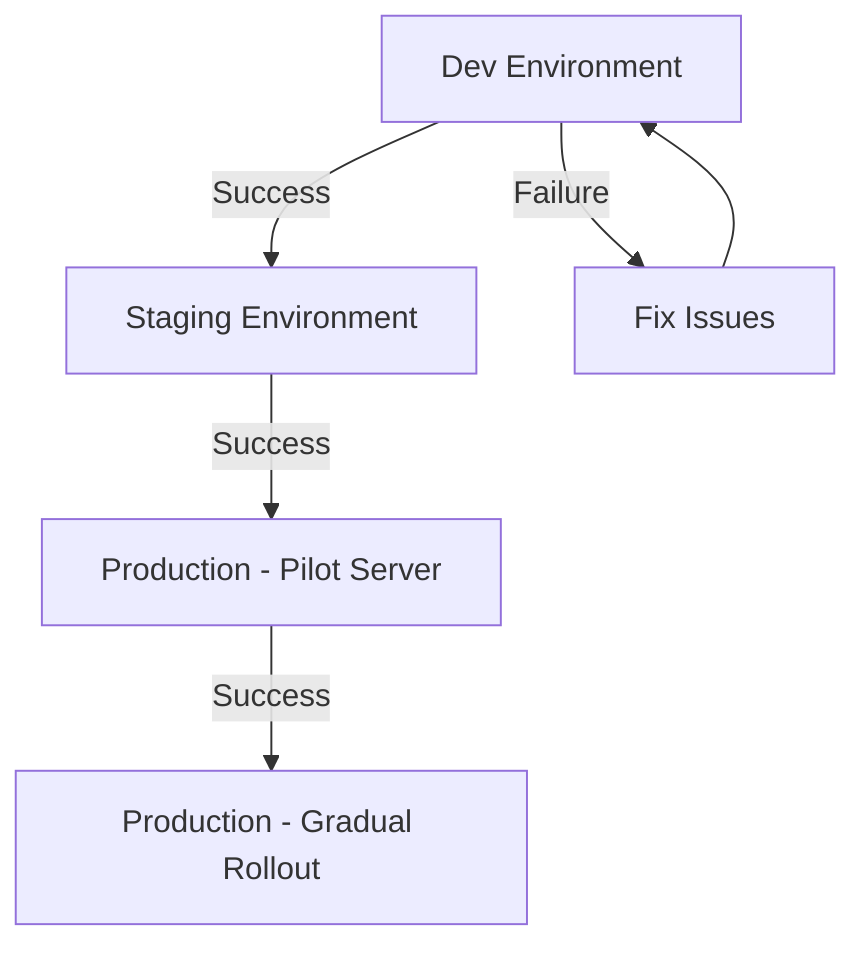

# Convert2RHEL Automation

Automated setup and conversion script for migrating compatible Linux distributions to Red Hat Enterprise Linux (RHEL).

## Table of Contents

- [Overview](#overview)
- [Features](#features)
- [Requirements](#requirements)
- [Installation](#installation)
- [Usage](#usage)
- [Configuration](#configuration)
- [Examples](#examples)
- [Troubleshooting](#troubleshooting)
- [Safety Considerations](#safety-considerations)
- [Logging](#logging)
- [Exit Codes](#exit-codes)
- [FAQ](#faq)

## Overview

This script automates the process of converting CentOS, AlmaLinux, Rocky Linux, Oracle Linux, or other RHEL-compatible distributions to genuine Red Hat Enterprise Linux using Red Hat's official `convert2rhel` tool. It handles all prerequisites, performs pre-conversion analysis, executes the conversion, and configures Red Hat Insights integration.

**Supported Source Distributions:**

- CentOS Linux 7.9, 8.5
- AlmaLinux 8.10, 9.6
- Oracle Linux 7.9, 8.10, 9.6
- Rocky Linux 8.10, 9.6

**Target RHEL Versions:** 7, 8, 9

## Features

- ✅ **Automatic RHEL version detection** - Intelligently detects your system version
- ✅ **Comprehensive error handling** - Fails fast with clear error messages and specific exit codes
- ✅ **Detailed logging** - Separate logs for main script, analysis, and conversion phases
- ✅ **Safety prompts** - Confirmation required for destructive operations
- ✅ **Analysis-only mode** - Test compatibility before converting
- ✅ **Skip analysis mode** - Skip pre-conversion checks (for advanced users)
- ✅ **True unattended operation** - Full automation with `-y` flag (handles all prompts)
- ✅ **Pre-flight validation** - Checks connectivity, privileges, disk space, and prerequisites
- ✅ **Insights integration** - Automatic Red Hat Insights client setup
- ✅ **Configuration backup** - Preserves existing configurations with timestamps
- ✅ **Color-coded output** - Easy-to-read status messages using `tput`
- ✅ **Secure temp directory** - Uses `mktemp` for temporary file handling
- ✅ **Network redundancy checks** - Tests multiple Red Hat endpoints

## Requirements

### System Requirements

- Root/sudo access
- RHEL-compatible distribution (see supported list above)
- Internet connectivity to Red Hat services
- Minimum 5 GB free disk space on root filesystem
- Valid Red Hat subscription or trial account
- 64-bit Intel/AMD architecture (x86_64)

### Red Hat Account Requirements

1. **Organization ID** - Found in your [Red Hat Customer Portal](https://access.redhat.com/)
2. **Activation Key** - Create at [Red Hat Activation Keys](https://console.redhat.com/insights/connector/activation-keys)

### How to Get Activation Keys

1. Log in to [Red Hat Console](https://console.redhat.com/)
2. Navigate to **Insights** → **Connector** → **Activation Keys**
3. Click **Create Activation Key**
4. Provide a name and select required subscriptions
5. Enable **Simple Content Access (SCA)** if not already enabled
6. Save the Organization ID and Activation Key securely

## Installation

### Quick Install

```bash
# Download the script
curl -fsSL -o convert2rhel-setup https://mkh.sh/convert2rhel-setup
# or
wget https://mkh.sh/convert2rhel-setup

# Verify download
ls -lh convert2rhel-setup

# Make executable
chmod +x convert2rhel-setup

# View help
./convert2rhel-setup --help
```

### Manual Installation

```bash
# Clone repository
git clone https://github.com/khodaparastan/convert2rhel-automation.git
cd convert2rhel-automation

# Make executable
chmod +x convert2rhel-setup

# Run the script
sudo ./convert2rhel-setup --org-id YOUR_ORG_ID --activation-key YOUR_KEY
```

## Usage

### Basic Syntax

```bash
./convert2rhel-setup [OPTIONS]
```

### Command-Line Options

| Option                       | Description                                           |
|:-----------------------------|:------------------------------------------------------|
| `-o, --org-id <ID>`          | Red Hat organization ID (required)                    |
| `-k, --activation-key <KEY>` | Red Hat activation key (required)                     |
| `-a, --analyze-only`         | Run analysis only without conversion                  |
| `-s, --skip-analysis`        | Skip pre-conversion analysis (⚠️ risky)               |
| `-y, --assume-yes`           | Skip ALL confirmation prompts (script + convert2rhel) |
| `-v, --verbose`              | Show verbose output from package manager commands     |
| `--skip-base-packages`       | Skip installation of base utility packages            |
| `-h, --help`                 | Display help message and exit                         |

### Environment Variables

| Variable            | Description                       | Default                           |
|:--------------------|:----------------------------------|:----------------------------------|
| `RH_ORG_ID`         | Red Hat organization ID           | None (required)                   |
| `RH_ACTIVATION_KEY` | Red Hat activation key            | None (required)                   |
| `LOG_FILE`          | Custom log file path              | `/var/log/convert2rhel-setup.log` |
| `SKIP_BASE_PKGS`    | Skip base package installation    | `false`                           |

### Important: Unattended Mode (`--assume-yes`)

The `--assume-yes` flag provides **true unattended automation** by:

✅ Skipping script's confirmation prompts
✅ **Passing `-y` flag to convert2rhel** (skips convert2rhel's internal prompts)
✅ Enabling fully automated execution for CI/CD pipelines

**Example of prompts that are skipped:**

- Script prompt: *"This will analyze the system for RHEL conversion. Continue?"*
- Convert2rhel prompt: *"By continuing, all further changes on the system will need to be reverted manually..."*

**Without `-y`:** Script will hang waiting for user input at multiple points
**With `-y`:** Script runs completely unattended from start to finish

## Configuration

### Method 1: Command-Line Arguments (Recommended)

```bash
./convert2rhel-setup \
  --org-id 1234567 \
  --activation-key my-activation-key
```

### Method 2: Environment Variables

```bash
export RH_ORG_ID="1234567"
export RH_ACTIVATION_KEY="my-activation-key"
./convert2rhel-setup
```

### Method 3: Mixed Approach

```bash
export RH_ORG_ID="1234567"
./convert2rhel-setup --activation-key my-activation-key
```

**Security Note:** Activation key is masked in logs showing only first 4 characters (e.g., `abcd********`)

## Examples

### Example 1: Analysis Only (⭐ Recommended First Step)

Test system compatibility before converting:

```bash
sudo ./convert2rhel-setup \
  --org-id 1234567 \
  --activation-key my-key \
  --analyze-only
```

**What it does:**

- ✅ Installs prerequisites (tmux, vim, wget, curl, sos - optional)
- ✅ Installs and configures convert2rhel
- ✅ Runs comprehensive compatibility analysis
- ✅ Generates detailed analysis report
- ❌ **Does NOT convert** the system
- ❌ Does not make any system changes

**Tip:** Use `--skip-base-packages` to skip optional utility installations.

**Output log:** `/var/log/convert2rhel-setup-analysis.log`

---

### Example 2: Interactive Conversion (Safest Production Method)

Full conversion with user confirmation prompts:

```bash
sudo ./convert2rhel-setup \
  --org-id 1234567 \
  --activation-key my-key
```

**What it does:**

- ⏸️ Prompts before running analysis
- ⏸️ Prompts before starting conversion
- ⏸️ Prompts at convert2rhel's critical checkpoint
- ⏸️ Prompts before reboot
- ✅ Allows manual review at each stage
- ✅ Full control over the process

**User will be prompted:**

1. *"This will analyze the system for RHEL conversion. Continue?"*
2. *"Are you absolutely sure you want to proceed with the conversion?"*
3. Convert2rhel will prompt: *"By continuing, all further changes..."*
4. *"Would you like to reboot now?"*

---

### Example 3: Fully Unattended Conversion (CI/CD & Automation)

Completely automated conversion with zero user interaction:

```bash
sudo ./convert2rhel-setup \
  --org-id 1234567 \
  --activation-key my-key \
  --assume-yes
```

**What it does:**

- 🤖 Runs without ANY user interaction
- 🤖 Automatically confirms all prompts
- 🤖 Passes `-y` to convert2rhel (critical!)
- 🤖 Proceeds through all phases automatically
- 🤖 Does NOT auto-reboot (manual reboot still required)
- ✅ Perfect for automation/orchestration
- ⚠️ **Use only after testing in analysis mode**

**Best for:**

- Ansible/Terraform playbooks
- CI/CD pipelines
- Mass conversions
- Scheduled maintenance windows

---

### Example 4: Unattended Analysis Only

Run analysis without any prompts:

```bash
sudo ./convert2rhel-setup \
  --org-id 1234567 \
  --activation-key my-key \
  --analyze-only \
  --assume-yes
```

**Perfect for:**

- Automated compliance scanning
- Pre-conversion audits at scale
- Non-disruptive testing

---

### Example 5: Skip Analysis (⚠️ Advanced/Risky)

Skip pre-conversion analysis and go straight to conversion:

```bash
sudo ./convert2rhel-setup \
  --org-id 1234567 \
  --activation-key my-key \
  --skip-analysis \
  --assume-yes
```

**⚠️ WARNING:** This is dangerous!

- Bypasses safety checks
- May result in failed conversion
- May leave system in broken state
- **Only use if you've already analyzed the system separately**

**Valid use case:**

- You ran analysis manually beforehand
- Re-running after fixing inhibitors
- Testing/development environments only

---

### Example 6: Custom Log File Location

Specify a custom location for logs:

```bash
sudo LOG_FILE=/custom/path/conversion.log \
  ./convert2rhel-setup \
  --org-id 1234567 \
  --activation-key my-key
```

**Log structure:**

- Main log: `/custom/path/conversion.log`
- Analysis: `/custom/path/conversion-analysis.log`
- Conversion: `/custom/path/conversion-conversion.log`

---

### Example 7: Using Environment Variables with sudo

```bash
# Set credentials once
export RH_ORG_ID="1234567"
export RH_ACTIVATION_KEY="my-activation-key"

# Run analysis (use -E to preserve environment)
sudo -E ./convert2rhel-setup --analyze-only

# Review results, then convert
sudo -E ./convert2rhel-setup --assume-yes
```

**Note:** The `-E` flag preserves environment variables through sudo.

---

### Example 8: Ansible Playbook Integration

```yaml
---
- name: Convert to RHEL
  hosts: centos_servers
  become: true
  vars:
    rh_org_id: "1234567"
    rh_activation_key: "{{ vault_activation_key }}"

  tasks:
    - name: Copy conversion script
      copy:
        src: convert2rhel-setup
        dest: /tmp/convert2rhel-setup
        mode: '0755'

    - name: Run analysis
      command: >
        /tmp/convert2rhel-setup
        --org-id {{ rh_org_id }}
        --activation-key {{ rh_activation_key }}
        --analyze-only
        --assume-yes
      register: analysis_result

    - name: Display analysis results
      debug:
        var: analysis_result.stdout_lines

    - name: Run conversion
      command: >
        /tmp/convert2rhel-setup
        --org-id {{ rh_org_id }}
        --activation-key {{ rh_activation_key }}
        --assume-yes
      when: analysis_result.rc == 0

    - name: Reboot system
      reboot:
        reboot_timeout: 600
```

## Troubleshooting

### Common Issues

#### Issue: "This script must be run as root"

**Solution:**

```bash
sudo ./convert2rhel-setup --org-id XXX --activation-key XXX
```

---

#### Issue: "No internet connectivity detected"

**Symptoms:** Script fails during connectivity check

**Solution:**

```bash
# Test connectivity manually
curl -I https://cdn.redhat.com
curl -I https://subscription.rhsm.redhat.com

# Check DNS
nslookup cdn.redhat.com

# Verify firewall
sudo firewall-cmd --list-all

# Check proxy settings if behind corporate proxy
echo $http_proxy
echo $https_proxy
```

**Required endpoints (automatically checked by script):**

- `https://redhat.com` (general connectivity)
- `https://cdn-public.redhat.com` (repository CDN)
- `https://subscription.rhsm.redhat.com` (subscription management)
- `https://cert.console.redhat.com` (certificates)

---

#### Issue: "Organization ID is required" or "Activation key is required"

**Solution:**

Provide credentials via command-line:

```bash
./convert2rhel-setup -o YOUR_ORG_ID -k YOUR_KEY
```

Or set environment variables:

```bash
export RH_ORG_ID="YOUR_ORG_ID"
export RH_ACTIVATION_KEY="YOUR_KEY"
sudo -E ./convert2rhel-setup
```

**Find your credentials:**

1. Org ID: [Red Hat Customer Portal](https://access.redhat.com/) → Account Settings
2. Activation Key: [Console](https://console.redhat.com/insights/connector/activation-keys)

---

#### Issue: "Unsupported RHEL version"

**Solution:**

Verify your system:

```bash
cat /etc/os-release
cat /etc/redhat-release  # if available
```

**Supported conversions:**

- CentOS Linux 7.9 → RHEL 7.9
- CentOS Linux 8.5 → RHEL 8.5
- AlmaLinux 8.10 → RHEL 8.10
- AlmaLinux 9.6 → RHEL 9.6
- Rocky Linux 8.10 → RHEL 8.10
- Rocky Linux 9.6 → RHEL 9.6
- Oracle Linux 7.9/8.10/9.6 → RHEL 7.9/8.10/9.6

---

#### Issue: "Insufficient disk space"

**Solution:**

Check available space:

```bash
df -h /
```

Clean up space:

```bash
# Clean package manager cache
sudo yum clean all   # or dnf clean all

# Remove old kernels (keep current and one backup)
sudo package-cleanup --oldkernels --count=2  # RHEL 7
sudo dnf remove $(dnf repoquery --installonly --latest-limit=-2 -q)  # RHEL 8/9

# Check for large log files
sudo du -sh /var/log/*

# Rotate logs if needed
sudo logrotate -f /etc/logrotate.conf
```

Required: Minimum 5 GB free on `/`

---

#### Issue: Analysis reports inhibitors

**What are inhibitors?**
Issues that MUST be fixed before conversion can proceed.

**Common inhibitors:**

- Outdated packages
- Custom kernel modules
- Third-party repositories enabled
- UEFI Secure Boot enabled
- FIPS mode enabled

**Solution:**

Review the analysis report:

```bash
sudo cat /var/log/convert2rhel-setup-analysis.log
```

Address each inhibitor:

```bash
# Update all packages
sudo yum update -y  # or dnf update -y

# Disable third-party repos during conversion
sudo yum-config-manager --disable epel

# Check for custom kernel modules
lsmod | grep -v "^Module"

# Disable Secure Boot (if applicable)
# This must be done in BIOS/UEFI settings
```

Then re-run analysis:

```bash
sudo ./convert2rhel-setup -o XXX -k XXX --analyze-only
```

---

#### Issue: Conversion fails during package replacement

**Solution:**

1. **Check detailed logs:**

```bash
sudo cat /var/log/convert2rhel-setup-conversion.log
sudo cat /var/log/convert2rhel/convert2rhel.log
```

1. **Common causes:**
   - Network interruption during download
   - Repository sync issues
   - Package conflicts

2. **Recovery steps:**

```bash
# Check if system is partially converted
rpm -qa | grep -i redhat

# Check subscription status
sudo subscription-manager status

# Try manual package cleanup
sudo yum clean all
sudo yum update
```

1. **Contact Red Hat Support** with:
   - All log files
   - Output of: `sosreport`
   - Steps to reproduce

---

### Viewing Logs

```bash
# View main script log
sudo less /var/log/convert2rhel-setup.log

# View analysis log
sudo less /var/log/convert2rhel-setup-analysis.log

# View conversion log
sudo less /var/log/convert2rhel-setup-conversion.log

# View convert2rhel's own logs
sudo less /var/log/convert2rhel/convert2rhel.log

# View last 50 lines
sudo tail -n 50 /var/log/convert2rhel-setup.log

# Follow log in real-time (during conversion)
sudo tail -f /var/log/convert2rhel-setup-conversion.log

# Search for errors across all logs
sudo grep -i error /var/log/convert2rhel*.log

# Search for warnings
sudo grep -i warning /var/log/convert2rhel*.log

# Get summary of issues
sudo grep -E "(ERROR|WARNING|FAILED)" /var/log/convert2rhel-setup.log
```

---

### Recovery Procedures

#### If Conversion Fails Mid-Process

1. **Assess system state:**

```bash
# Check OS identification
cat /etc/os-release
cat /etc/redhat-release

# Check installed packages
rpm -qa | grep -i redhat | wc -l
rpm -qa | grep -i centos | wc -l

# Check subscription status
sudo subscription-manager status
```

1. **Review all logs:**

```bash
# Main script log
sudo less /var/log/convert2rhel-setup.log

# Convert2rhel log (most detailed)
sudo less /var/log/convert2rhel/convert2rhel.log

# Package manager log
sudo less /var/log/yum.log  # or dnf.log
```

1. **Check for rollback possibility:**

Convert2RHEL has limited automatic rollback:

- **Before package replacement:** Automatic rollback available
- **After package replacement starts:** Manual recovery required

1. **Restore from backup:**

If you have a backup (recommended):

```bash
# For VM snapshots
# Revert to pre-conversion snapshot

# For bare metal with backup
# Follow your backup solution's restore procedure
```

1. **Contact Red Hat Support:**

Open a support case with:

- All log files from `/var/log/convert2rhel*/`
- Output of: `sudo sosreport`
- System information: `uname -a` and `cat /etc/os-release`
- Timeline of events

---

### Debug Mode

For troubleshooting, you can enable verbose logging:

```bash
# Method 1: Use built-in verbose mode (v1.3.0+)
sudo ./convert2rhel-setup \
  --org-id XXX \
  --activation-key XXX \
  --verbose \
  --analyze-only

# Method 2: Shell debug mode (shows every command)
sudo bash -x ./convert2rhel-setup \
  --org-id XXX \
  --activation-key XXX \
  --analyze-only 2>&1 | tee debug.log
```

**Verbose mode (`-v, --verbose`)** shows package manager output in real-time, making troubleshooting faster during interactive sessions.

## Safety Considerations

### ⚠️ Critical Warnings

#### 1. **Backup Everything**

**Before conversion:**

```bash
# For VMs - Take snapshot
# For physical servers - Use your backup solution

# Verify backup
# Test restore procedure
# Document current state
```

**What to backup:**

- ✅ Full system backup (bare metal or snapshot)
- ✅ Database dumps
- ✅ Application configurations
- ✅ Custom scripts and cron jobs
- ✅ `/etc` directory
- ✅ User home directories
- ✅ Application data directories

---

#### 2. **Test First - Always!**

**Recommended testing sequence:**



**Never:**

- ❌ Convert production without testing
- ❌ Skip the analysis phase
- ❌ Ignore warnings in analysis report
- ❌ Proceed with unresolved inhibitors

---

#### 3. **Maintenance Window Planning**

**Time allocation:**

- Pre-checks: 15 minutes
- Analysis: 10-15 minutes
- Conversion: 30-60 minutes
- Reboot: 5 minutes
- Post-conversion validation: 30 minutes
- **Buffer time:** 2x estimated time

**Total recommended window:** 4-6 hours

---

#### 4. **Network Requirements**

**Required during entire conversion:**

- ✅ Stable internet connection
- ✅ Access to Red Hat CDN
- ✅ DNS resolution working
- ✅ No firewall blocking Red Hat endpoints

**Test before conversion:**

```bash
# Test all required endpoints
for url in \
  https://cdn.redhat.com \
  https://subscription.rhsm.redhat.com \
  https://cert.console.redhat.com; do
  echo "Testing: $url"
  curl -I --connect-timeout 10 $url || echo "FAILED: $url"
done
```

---

#### 5. **Rollback Planning**

**Limited automatic rollback:**

- ✅ Before package replacement: Automatic
- ❌ After package replacement: Manual only

**Rollback options:**

1. **Restore from backup** (recommended)
2. **Manual recovery** (complex, error-prone)
3. **Contact Red Hat Support** (if subscribed)

**Document rollback procedure** specific to your environment.

---

### Pre-Conversion Checklist

Use this checklist before converting any system:

#### Planning & Preparation

- [ ] Maintenance window scheduled (4-6 hours)
- [ ] Stakeholders notified
- [ ] Emergency contacts identified
- [ ] Rollback plan documented
- [ ] Post-conversion testing plan ready

#### Technical Prerequisites

- [ ] Full system backup completed
- [ ] Backup verified and restorable
- [ ] Valid Red Hat subscription available
- [ ] Organization ID and activation key obtained
- [ ] Network connectivity to Red Hat services verified
- [ ] Minimum 5 GB free disk space confirmed

#### Pre-Conversion Testing

- [ ] Script tested in dev/staging environment
- [ ] Analysis completed successfully (`--analyze-only`)
- [ ] All inhibitors resolved
- [ ] All warnings reviewed and accepted
- [ ] Application compatibility verified

#### System State

- [ ] All packages updated to latest minor version
- [ ] No custom kernel modules loaded
- [ ] UEFI Secure Boot disabled (if applicable)
- [ ] Third-party repositories disabled
- [ ] Services documented and tested

#### Final Checks

- [ ] Production application stopped (if required)
- [ ] Database backup created
- [ ] Configuration management disabled temporarily
- [ ] Monitoring alerts adjusted
- [ ] On-call team ready

---

### What Gets Changed During Conversion

#### Packages

- ✏️ All vendor packages replaced with RHEL equivalents
- ✏️ Third-party packages remain unchanged
- ⚠️ Orphaned packages may remain (review after conversion)

#### Repositories

- ✏️ Vendor repos disabled/removed
- ✏️ RHEL repos configured
- ✏️ Repository files in `/etc/yum.repos.d/` modified

#### System Files

- ✏️ `/etc/os-release` updated
- ✏️ `/etc/redhat-release` updated
- ✏️ GPG keys updated
- ✏️ Subscription manager configured

#### Services

- ✅ Most services continue running during conversion
- ✅ Services automatically restart if needed
- ⚠️ Some service configuration files may be updated

#### What Does NOT Change

- ✅ User data (`/home`, `/srv`)
- ✅ Application data
- ✅ Custom configurations (unless conflicting)
- ✅ Network configuration
- ✅ Hostname and IP address

---

### Risk Assessment

| Risk Level     | Scenario                                                    |
|:---------------|:------------------------------------------------------------|
| 🟢 **Low**     | Dev/test environment, recent backup, tested in staging      |
| 🟡 **Medium**  | Production, backup available, analysis passed with warnings |
| 🔴 **High**    | Production, no backup, analysis shows inhibitors            |
| ⛔ **Critical** | Production, no backup, skipping analysis                    |

**Never proceed with HIGH or CRITICAL risk scenarios.**

## Logging

### Log File Structure

| Component            | Log Path                                       | Purpose                                |
|:---------------------|:-----------------------------------------------|:---------------------------------------|
| **Main Script**      | `/var/log/convert2rhel-setup.log`              | Overall execution flow                 |
| **Analysis Phase**   | `/var/log/convert2rhel-setup-analysis.log`     | Pre-conversion analysis output         |
| **Conversion Phase** | `/var/log/convert2rhel-setup-conversion.log`   | Conversion process output              |
| **Convert2RHEL**     | `/var/log/convert2rhel/convert2rhel.log`       | Convert2rhel tool logs (most detailed) |
| **RPM Verification** | `/var/log/convert2rhel/rpm_va.log`             | Modified package files                 |
| **Package Manager**  | `/var/log/yum.log` or `/var/log/dnf.log`       | Package transactions                   |
| **Insights Client**  | `/var/log/insights-client/insights-client.log` | Insights registration                  |

### Log Levels

Logs contain the following levels:

- `[INFO]` - Normal operation messages
- `[SUCCESS]` - Successful completion of operations
- `[WARNING]` - Non-critical issues
- `[ERROR]` - Critical failures
- `[SYSTEM]` - System-level events

### Log Retention Best Practices

```bash
# Archive logs after conversion
sudo mkdir -p /var/log/convert2rhel-archives
sudo mv /var/log/convert2rhel*.log \
        /var/log/convert2rhel-archives/conversion-$(date +%Y%m%d).log

# Compress old logs
sudo tar -czf /var/log/convert2rhel-archives/conversion-$(date +%Y%m%d).tar.gz \
              /var/log/convert2rhel-archives/*.log
sudo rm /var/log/convert2rhel-archives/*.log

# Keep logs for audit purposes
# Recommended retention: 90 days minimum
```

### Centralized Logging

For enterprise environments:

```bash
# Forward logs to centralized logging (rsyslog example)
cat <<EOF | sudo tee /etc/rsyslog.d/convert2rhel.conf
# Forward convert2rhel logs
\$ModLoad imfile
\$InputFileName /var/log/convert2rhel-setup.log
\$InputFileTag convert2rhel:
\$InputFileStateFile stat-convert2rhel
\$InputFileSeverity info
\$InputFileFacility local0
\$InputRunFileMonitor

local0.* @@your-log-server:514
EOF

sudo systemctl restart rsyslog
```

## Exit Codes

The script uses specific exit codes for automation and error handling:

| Exit Code | Meaning              | Description                                                     |
|:----------|:---------------------|:----------------------------------------------------------------|
| **0**     | Success              | All operations completed successfully                           |
| **1**     | General Error        | Unspecified error occurred                                      |
| **2**     | Invalid Arguments    | Invalid command-line arguments or missing required parameters   |
| **3**     | Prerequisites Failed | Pre-flight checks failed (root, connectivity, disk space, etc.) |
| **4**     | Analysis Failed      | Pre-conversion analysis found blocking issues                   |
| **5**     | Conversion Failed    | Conversion process failed                                       |
| **130**   | Interrupted          | User interrupted with Ctrl+C                                    |
| **143**   | Terminated           | Process terminated by signal                                    |

### Using Exit Codes in Automation

```bash
# Bash example
./convert2rhel-setup -o XXX -k XXX --analyze-only
case $? in
  0)
    echo "Analysis passed - safe to convert"
    ;;
  4)
    echo "Analysis found issues - review logs"
    exit 1
    ;;
  *)
    echo "Unexpected error"
    exit 1
    ;;
esac

# Ansible example
- name: Run analysis
  command: ./convert2rhel-setup -o {{ org_id }} -k {{ key }} --analyze-only
  register: analysis
  ignore_errors: yes

- name: Check analysis result
  fail:
    msg: "Analysis failed with exit code {{ analysis.rc }}"
  when: analysis.rc != 0

# Python example
import subprocess

result = subprocess.run([
    './convert2rhel-setup',
    '-o', org_id,
    '-k', activation_key,
    '--analyze-only'
])

if result.returncode == 0:
    print("Analysis passed")
elif result.returncode == 4:
    print("Analysis found blocking issues")
else:
    print(f"Error: exit code {result.returncode}")
```

## FAQ

### General Questions

#### Q: How long does conversion take?

**A:** Typically 30-60 minutes, depending on:

- Number of installed packages (more packages = longer time)
- Network speed (downloading RHEL packages)
- System resources (CPU, RAM, disk I/O)
- Server workload during conversion

**Time breakdown:**

- Analysis: 10-15 minutes
- Package download: 15-30 minutes
- Package installation: 15-30 minutes
- Post-configuration: 5 minutes

---

#### Q: Can I convert back to CentOS/Oracle Linux?

**A:** No, conversion is one-way and irreversible. Always maintain backups for rollback capability.

---

#### Q: Will my data be deleted?

**A:** No, user data in `/home`, `/srv`, and application directories remains intact. However:

- Always backup before conversion
- Package configurations may be updated
- Test in non-production first

---

#### Q: Do I need to reboot?

**A:** Yes, reboot is **required** after conversion to:

- Boot the new RHEL kernel
- Complete the conversion process
- Apply system-wide changes

**Note:** The script prompts for reboot but does NOT auto-reboot (even with `-y`)

---

#### Q: What happens to custom repositories?

**A:** Custom repositories:

- Remain configured but should be reviewed
- May need to be disabled or updated for RHEL compatibility
- Third-party packages from these repos are not converted

**After conversion:**

```bash
# List remaining repos
sudo yum repolist all

# Disable incompatible repos
sudo yum-config-manager --disable <repo-name>
```

---

#### Q: Can I convert a running production system?

**A:** Yes, but with caution:

- Services continue running during conversion
- Some service disruption is possible
- Plan for maintenance window
- **Always test in non-production first**

---

#### Q: Is a subscription included with the script?

**A:** No, you need:

- Valid RHEL subscription (paid)
- Or RHEL developer subscription (free for development)
- Or RHEL evaluation subscription (60-day trial)

Get subscriptions at: [Red Hat Customer Portal](https://access.redhat.com/)

---

#### Q: What if I don't have an activation key?

**A:** Create one (free with subscription):

1. Go to [Red Hat Activation Keys](https://console.redhat.com/insights/connector/activation-keys)
2. Click "Create Activation Key"
3. Name it and associate your subscription
4. Copy the key and organization ID

---

### Technical Questions

#### Q: Can I automate this for multiple servers?

**A:** Yes! Use:

- `--assume-yes` flag for unattended operation
- Ansible/Terraform for orchestration
- Configuration management tools
- CI/CD pipelines

**Example automation:**

```bash
# Ansible inventory
for host in $(cat servers.txt); do
  ansible $host -b -m copy \
    -a "src=convert2rhel-setup dest=/tmp/ mode=0755"
  ansible $host -b -m command \
    -a "/tmp/convert2rhel-setup -o {{ org_id }} -k {{ key }} -a -y"
done
```

---

#### Q: What happens if network fails during conversion?

**A:** Convert2RHEL is designed to handle interruptions:

- Package downloads use rpm transaction sets
- Partial conversions can be problematic
- System may be in inconsistent state

**Prevention:**

- Ensure stable network before starting
- Use local mirror if available
- Have console access for recovery

**Recovery:**

- Restore from backup (safest)
- Contact Red Hat Support for guidance
- Do not attempt manual fixes without support

---

#### Q: Does it work with proxy servers?

**A:** Yes, configure proxy before running:

```bash
# Set proxy environment variables
export http_proxy="http://proxy.example.com:8080"
export https_proxy="http://proxy.example.com:8080"
export no_proxy="localhost,127.0.0.1"

# Run conversion
sudo -E ./convert2rhel-setup -o XXX -k XXX
```

Or configure in yum/dnf:

```bash
# For yum (RHEL 7)
sudo tee -a /etc/yum.conf <<EOF
proxy=http://proxy.example.com:8080
EOF

# For dnf (RHEL 8/9)
sudo tee -a /etc/dnf/dnf.conf <<EOF
proxy=http://proxy.example.com:8080
EOF
```

---

#### Q: Can I convert systems without internet access?

**A:** Yes, but requires preparation:

1. Setup local RHEL repository mirror
2. Configure script to use local repos
3. Manually download convert2rhel package

See: [Creating a Local Repository](https://access.redhat.com/solutions/3176811)

---

#### Q: What about systems with custom kernels?

**A:** Custom kernels are not supported:

- Convert2RHEL requires standard distribution kernel
- Custom kernel modules should be removed before conversion
- After conversion, reinstall compatible custom modules

**Before conversion:**

```bash
# Check current kernel
uname -r

# List custom kernel modules
lsmod | grep -v "$(lsmod | awk 'NR==1')"

# Remove custom modules (example)
sudo modprobe -r <module_name>
```

---

#### Q: How do I handle firewall rules?

**A:** Firewall rules are preserved, but ensure access to:

```bash
# Required Red Hat endpoints
sudo firewall-cmd --permanent --add-service=https
sudo firewall-cmd --reload

# Or specific hosts
sudo firewall-cmd --permanent --add-rich-rule='
  rule family="ipv4"
  destination address="cdn.redhat.com"
  accept'
```

---

#### Q: What about SELinux?

**A:** SELinux configuration is preserved:

- Current mode (Enforcing/Permissive/Disabled) remains
- Policy updates to RHEL version
- Custom rules may need review

**Check status:**

```bash
sestatus
getenforce
```

---

#### Q: Can I skip the analysis phase?

**A:** **Not recommended**, but possible with `-s/--skip-analysis`:

```bash
sudo ./convert2rhel-setup -o XXX -k XXX --skip-analysis -y
```

**Only skip if:**

- You've run analysis separately and resolved all issues
- Testing in non-production environment
- You understand the risks

**Risks of skipping:**

- Conversion may fail mid-process
- System may be left in broken state
- Manual recovery may be required

---

#### Q: What is the `--assume-yes` flag behavior?

**A:** In version 1.2.0+, it provides **complete automation**:

✅ Skips script's own prompts
✅ **Passes `-y` to convert2rhel** (this is critical!)
✅ Handles all interactive prompts automatically
✅ Enables true unattended operation

**In older versions (1.1.0 and below):**

- ❌ Only skipped script prompts
- ❌ Did NOT pass `-y` to convert2rhel
- ❌ Would hang at convert2rhel's prompts
- **Solution:** Upgrade to 1.2.0+

**Check your version:**

```bash
./convert2rhel-setup --help | grep "version"
```

---

### Post-Conversion Questions

#### Q: What should I do immediately after conversion?

**Post-conversion checklist:**

```bash
# 1. Verify OS
cat /etc/redhat-release

# 2. Check subscription
sudo subscription-manager status

# 3. Update to latest packages
sudo yum update -y

# 4. Verify critical services
sudo systemctl status <your-critical-services>

# 5. Test applications
# Run your application test suite

# 6. Clean up
sudo yum remove $(yum list extras --disablerepo="*" --enablerepo=rhel-* -q)

# 7. Review logs for issues
sudo grep -i error /var/log/convert2rhel*.log
```

---

#### Q: How do I verify the conversion was successful?

**Verification steps:**

```bash
# 1. Check OS identification
cat /etc/redhat-release
# Expected: Red Hat Enterprise Linux release X.Y

cat /etc/os-release
# Expected: NAME="Red Hat Enterprise Linux"

# 2. Verify package sources
rpm -qa | grep -i centos
# Expected: Empty output (no CentOS packages)

rpm -qa | grep -i redhat | wc -l
# Expected: Many packages

# 3. Check subscription
sudo subscription-manager identity
sudo subscription-manager list --consumed

# 4. Verify repositories
sudo yum repolist
# Expected: rhel-* repositories

# 5. Verify Insights registration
sudo insights-client --status

# 6. Check kernel
uname -r
# Expected: Red Hat kernel
```

---

#### Q: Should I remove leftover packages?

**A:** Yes, review and remove unnecessary packages:

```bash
# List packages not from RHEL repos
sudo yum list extras --disablerepo="*" --enablerepo=rhel-*

# Review the list carefully, then remove
sudo yum remove <package-name>

# Be cautious with:
# - Application-specific packages
# - Custom compiled software
# - Third-party tools you still need
```

---

#### Q: How do I upgrade to newer RHEL version after conversion?

**A:** After converting to RHEL 7 or 8, you can upgrade:

**RHEL 7 → RHEL 8:**
Follow: [Upgrading from RHEL 7 to RHEL 8](https://access.redhat.com/documentation/en-us/red_hat_enterprise_linux/8/html/upgrading_from_rhel_7_to_rhel_8/)

**RHEL 8 → RHEL 9:**
Follow: [Upgrading from RHEL 8 to RHEL 9](https://access.redhat.com/documentation/en-us/red_hat_enterprise_linux/9/html/upgrading_from_rhel_8_to_rhel_9/)

**Note:** These are separate in-place upgrade procedures, not conversions.

## Script Workflow Diagram

```text
┌─────────────────────────────────────────────────────────────┐
│                    SCRIPT INITIALIZATION                     │
│  • Parse command-line arguments                             │
│  • Set up logging infrastructure                            │
│  • Create secure temporary directory                        │
└──────────────────────┬──────────────────────────────────────┘
                       │
                       ▼
┌─────────────────────────────────────────────────────────────┐
│                  PRE-FLIGHT CHECKS                          │
│  ✓ Check root privileges                                    │
│  ✓ Verify required commands exist                           │
│  ✓ Validate flag combinations                               │
│  ✓ Detect package manager (dnf/yum)                         │
│  ✓ Detect RHEL version                                      │
│  ✓ Validate organization ID and activation key              │
│  ✓ Check connectivity (redhat.com, cdn-public, rhsm)        │
│  ✓ Verify minimum disk space (5 GB)                         │
└──────────────────────┬──────────────────────────────────────┘
                       │
                       ▼
┌─────────────────────────────────────────────────────────────┐
│                  INSTALLATION PHASE                          │
│  → Install base packages (optional with --skip-base-packages)│
│  → Download and install Red Hat GPG key                     │
│  → Install convert2rhel repository (version-specific)        │
│  → Install convert2rhel package                             │
│  → Configure convert2rhel with credentials                  │
│  ✓ Backup existing configuration (if present)               │
│  ✓ Set secure permissions (600)                             │
└──────────────────────┬──────────────────────────────────────┘
                       │
                       ▼
              ┌────────┴────────┐
              │                 │
         -s, --skip-         (default)
          analysis?
              │                 │
              NO                YES
              │                 │
              │                 ▼
              │    ┌──────────────────────────────────┐
              │    │      ANALYSIS PHASE              │
              │    │  → Run convert2rhel analyze      │
              │    │  → Pass -y if --assume-yes set   │
              │    │  → Log to analysis-specific file │
              │    │  → Report inhibitors/warnings    │
              │    │  ✓ Must pass to continue         │
              │    └────────────┬─────────────────────┘
              │                 │
              └─────────────────┘
                       │
                       ▼
              ┌────────┴────────┐
              │                 │
         -a, --analyze-       (default)
            only?
              │                 │
              YES               NO
              │                 │
              │                 ▼
              │    ┌──────────────────────────────────┐
              │    │      CONVERSION PHASE            │
              │    │  ⚠️  CRITICAL OPERATION          │
              │    │  → Prompt for confirmation       │
              │    │     (unless -y flag set)         │
              │    │  → Run convert2rhel              │
              │    │  → Pass -y if --assume-yes set   │
              │    │  → Replace all vendor packages   │
              │    │  → Update repositories           │
              │    │  → Register with subscription    │
              │    │  → Log to conversion-specific    │
              │    │     file with full output        │
              │    └────────────┬─────────────────────┘
              │                 │
              │                 ▼
              │    ┌──────────────────────────────────┐
              │    │   POST-CONVERSION SETUP          │
              │    │  → Install insights-client       │
              │    │  → Register with Red Hat Insights│
              │    │  → Cleanup temporary files       │
              │    │  ✓ Non-critical (warnings only)  │
              │    └────────────┬─────────────────────┘
              │                 │
              └─────────────────┘
                       │
                       ▼
┌─────────────────────────────────────────────────────────────┐
│                     COMPLETION                              │
│  → Display summary with timestamps                          │
│  → Show log file locations                                  │
│  → Prompt for reboot (if conversion was performed)          │
│  → Exit with appropriate code (0=success, 1-5=errors)       │
└─────────────────────────────────────────────────────────────┘
                       │
                       ▼
               Manual Reboot Required
              (to boot RHEL kernel)
```

### Key Decision Points

| Decision Point     | Flag                  | Behavior                                                                    |
|:-------------------|:----------------------|:----------------------------------------------------------------------------|
| **Skip Analysis?** | `-s, --skip-analysis` | YES: Skip directly to conversion / NO: Run analysis first (recommended)     |
| **Analysis Only?** | `-a, --analyze-only`  | YES: Stop after analysis / NO: Continue to conversion                       |
| **Auto-confirm?**  | `-y, --assume-yes`    | YES: No prompts (passes -y to convert2rhel) / NO: Prompt at critical points |

## Support

### Official Resources

| Resource                        | Link                                                                                                                                                                       | Purpose                   |
|:--------------------------------|:---------------------------------------------------------------------------------------------------------------------------------------------------------------------------|:--------------------------|
| **Convert2RHEL Documentation**  | [Red Hat Docs](https://access.redhat.com/documentation/en-us/red_hat_enterprise_linux/8/html/converting_from_a_linux_distribution_to_rhel_using_the_convert2rhel_utility/) | Official conversion guide |
| **Red Hat Support**             | [Customer Portal](https://access.redhat.com/support)                                                                                                                       | Open support cases        |
| **Activation Keys**             | [Console](https://console.redhat.com/insights/connector/activation-keys)                                                                                                   | Manage activation keys    |
| **Supported Conversions**       | [KB Article](https://access.redhat.com/articles/2360841)                                                                                                                   | Compatibility matrix      |
| **Convert2RHEL Support Policy** | [Support Policy](https://access.redhat.com/support/policy/convert2rhel-support)                                                                                            | What's covered            |

### Getting Help

#### 1. Self-Service Troubleshooting

```bash
# Check all logs
sudo grep -i error /var/log/convert2rhel*.log

# Run analysis to identify issues
sudo ./convert2rhel-setup -o XXX -k XXX --analyze-only

# Check system state
cat /etc/redhat-release
sudo subscription-manager status
```

#### 2. Red Hat Support

Open a support case if:

- Conversion fails unexpectedly
- System is in inconsistent state after failure
- Analysis shows blocking issues you can't resolve
- You need guidance on inhibitors

**Information to provide:**

- All log files from `/var/log/convert2rhel*/`
- Output of `sosreport`:

```bash
sudo sosreport --batch --tmp-dir=/tmp
```

- System information:

```bash
uname -a
cat /etc/os-release
df -h
free -h
```

- Steps to reproduce the issue

#### 3. Community Resources

- **Red Hat Customer Portal:** [access.redhat.com](https://access.redhat.com)
- **Red Hat Discussions:** Community forums
- **GitHub Issues:** (if script is hosted on GitHub)

### Support Scope

**Covered by Red Hat Support:**

- ✅ Convert2RHEL tool issues
- ✅ Subscription and registration problems
- ✅ Package conflicts during conversion
- ✅ RHEL system issues after conversion

**Not covered:**

- ❌ Custom third-party software
- ❌ Custom kernel modules
- ❌ This wrapper script issues (contact script maintainer)
- ❌ Applications not from RHEL repositories

## License

This script is provided as-is for use with Red Hat Enterprise Linux subscriptions. See Red Hat's terms of service for subscription details.

## Disclaimer

**⚠️ Important Notice:**

This script performs system-level modifications that are **irreversible**. Always:

- ✅ Test in non-production environments first
- ✅ Maintain complete system backups
- ✅ Review Red Hat's official documentation
- ✅ Plan for adequate maintenance windows
- ✅ Have rollback procedures ready
- ✅ Verify subscription entitlements

**Liability:**

The authors and contributors are not responsible for:

- ❌ Data loss or corruption
- ❌ System failures or downtime
- ❌ Failed conversions
- ❌ Application compatibility issues
- ❌ Business impact or revenue loss

**Use at your own risk.** This script is provided "as-is" without warranty of any kind.

**Recommendations:**

1. Always run `--analyze-only` before conversion
2. Review analysis reports thoroughly
3. Test complete workflow in development
4. Have Red Hat Support available during production conversions
5. Document every step of your conversion process

---

**Current Version:** 1.3.0
**Last Updated:** 2025-10-01
**Maintained By:** Khodaparastan
**Script Repository:** [GitHub](https://github.com/khodaparastan/convert2rhel-automation)

---

## Quick Reference Card

💡 **Tip:** For a detailed quick reference guide with examples, see [QUICK_REFERENCE.md](QUICK_REFERENCE.md)

```text
╔══════════════════════════════════════════════════════════════╗
║            Convert2RHEL Setup - Quick Reference             ║
╠══════════════════════════════════════════════════════════════╣
║ REQUIRED PARAMETERS:                                         ║
║   -o, --org-id <ID>          Your Red Hat org ID            ║
║   -k, --activation-key <KEY> Your activation key            ║
║                                                              ║
║ OPERATIONAL MODES:                                           ║
║   -a, --analyze-only         Analysis only (safe)           ║
║   -s, --skip-analysis        Skip analysis (risky!)         ║
║   -y, --assume-yes           Fully unattended              ║
║                                                              ║
║ COMMON WORKFLOWS:                                            ║
║   # Safe: Analysis first                                     ║
║   sudo ./convert2rhel-setup -o XXX -k YYY -a             ║
║                                                              ║
║   # Interactive: With prompts                                ║
║   sudo ./convert2rhel-setup -o XXX -k YYY                ║
║                                                              ║
║   # Automated: No prompts                                    ║
║   sudo ./convert2rhel-setup -o XXX -k YYY -y             ║
║                                                              ║
║ LOGS:                                                        ║
║   /var/log/convert2rhel-setup.log         Main log          ║
║   /var/log/convert2rhel-setup-analysis.log  Analysis        ║
║   /var/log/convert2rhel-setup-conversion.log Conversion     ║
║                                                              ║
║ EXIT CODES:                                                  ║
║   0 = Success    2 = Bad args     4 = Analysis failed       ║
║   1 = Error      3 = Prerequisites 5 = Conversion failed    ║
║                                                              ║
║ HELP:                                                        ║
║   ./convert2rhel-setup --help                            ║
╚══════════════════════════════════════════════════════════════╝
```

📖 **Full documentation:** See sections above
🚀 **Detailed quick reference:** [QUICK_REFERENCE.md](QUICK_REFERENCE.md)
🐛 **Troubleshooting:** See [Troubleshooting](#troubleshooting) section
💬 **Support:** [Red Hat Customer Portal](https://access.redhat.com/support)
